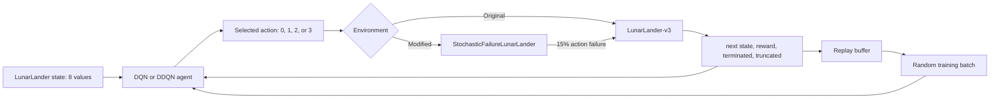
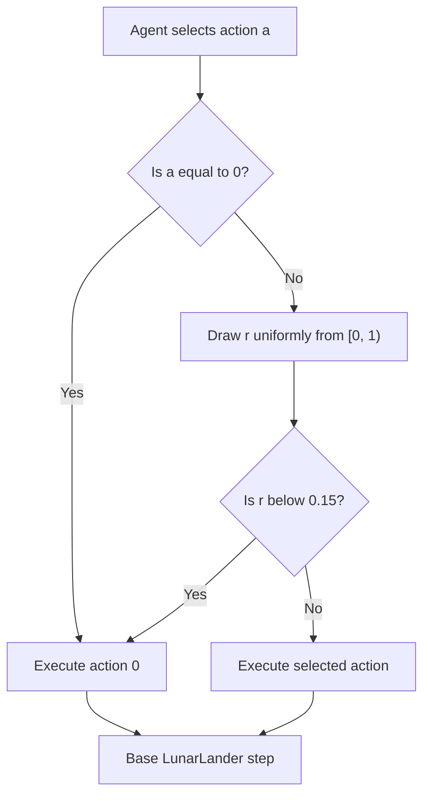
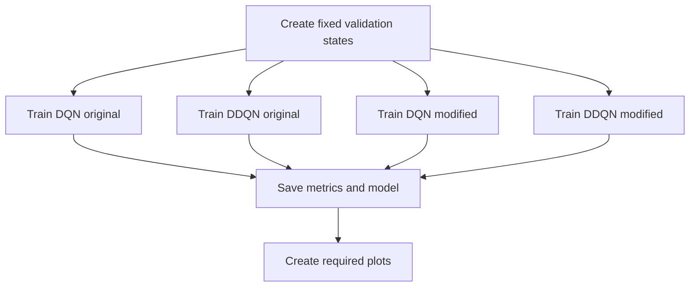

# Architecture Reference

## System overview



The agent sees only the regular Gymnasium transition interface. In the modified
environment it does not receive a signal saying that a selected engine failed.

## Modules and responsibilities

| Module | Responsibility |
| --- | --- |
| `lunar_lander_failure_env.py` | Applies engine failures and modified reward. |
| `verify_environment.py` | Verifies failure-rate and fuel-penalty behaviour. |
| `replay_buffer.py` | Stores transitions and returns random mini-batches. |
| `q_network.py` | Predicts one Q-value per available action. |
| `dqn_agent.py` | Implements DQN action selection and learning. |
| `ddqn_agent.py` | Implements DDQN's target-Q calculation. |
| `train_experiments.py` | Runs and saves all four controlled experiments. |

## Modified environment

### Action flow



The wrapper returns the same state/action spaces, episode rules, and `info`
dictionary as the base environment. It changes only executed action and reward.

### Reward

```text
R = R_base - 0.3 x I(selected action is a thruster) + landing bonus
```

Fuel cost uses the selected action, not the executed action. A failed engine
request therefore still costs `0.3`.

The `+50` safe-landing bonus requires all of these conditions:

1. `terminated` is true and `truncated` is false.
2. Both landing legs have contact.
3. Absolute horizontal and vertical velocity are below `0.10`.
4. Absolute orientation angle is below `0.10` radians.

## Neural network

```text
Input: 8 state values
  -> Linear(8, 128) + ReLU
  -> Linear(128, 128) + ReLU
  -> Linear(128, 4)
Output: Q-values for actions 0, 1, 2, and 3
```

A Q-value estimates total future reward after selecting an action in the
current state. The greedy action is the action with the greatest Q-value.

## Replay buffer

Each environment interaction is stored as:

```text
(state, action, reward, next_state, done)
```

The buffer holds 100,000 transitions and randomly samples batches of 64.
Random batches reduce the strong correlation between consecutive simulator
steps, making neural-network learning more stable.

## DQN and DDQN learning

For both methods, the agent predicts:

```text
Q_online(state, selected_action)
```

The DQN target is:

```text
target = reward + gamma x (1 - done) x max_a Q_target(next_state, a)
```

DDQN changes only the next-state calculation:

```text
best_next_action = argmax_a Q_online(next_state, a)
target = reward + gamma x (1 - done)
         x Q_target(next_state, best_next_action)
```

Thus DQN uses its target network to select and evaluate a next action. DDQN
uses the online network to select it and target network to evaluate it. This
often reduces overly optimistic Q-value estimates.

## Training and evaluation



The validation states are collected once, with a seeded random policy, and are
never changed. This makes Q-value graphs comparable across all four runs.

Each experiment saves:

```text
outputs/<algorithm>_<environment>_model.pt
outputs/<algorithm>_<environment>_metrics.npz
outputs/<algorithm>_<environment>_metadata.json
```

The `.npz` file has episode rewards, predicted Q-values, 100-episode
safe-landing rate, requested thruster actions, and loss values.

## Controlled-experiment checklist

All four runs must use the same:

- training episodes and seed
- network architecture
- replay-buffer capacity and batch size
- optimizer and learning rate
- discount factor and epsilon schedule
- target-network update interval
- validation-state set

This isolates the effects of the learning algorithm and stochastic action
failure.
